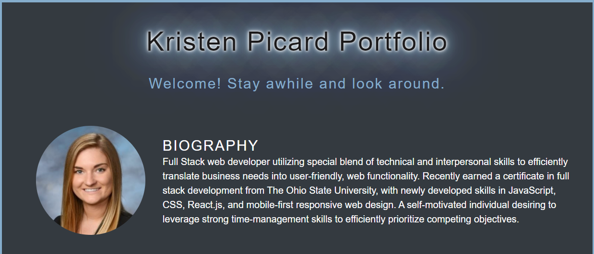
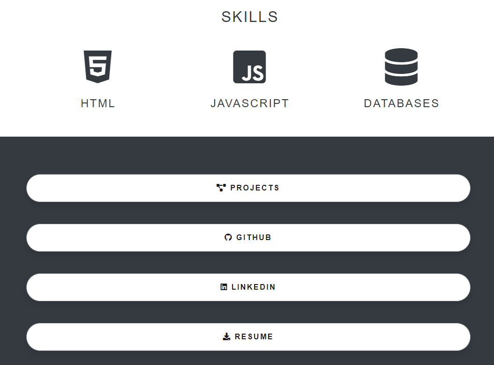
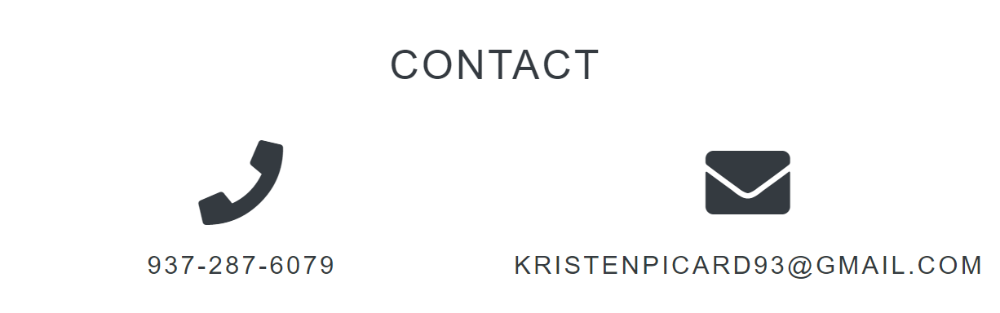
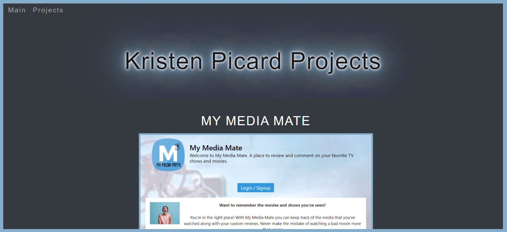

# React Personal Portfolio

## Description

As I learn and grow as a developer, I wanted one place where I could showcase my projects and provide other developers and potential employers more information about who I am.

This project was created using React.

This page includes a small bio with a photo of me:
 

There is a section to list my skills as well as a list of buttons that take you to various documents and pages that give more information about me as a developer and professional:
 

I have a section listing ways to contact me:
 

When the "Projects" button is clicked, it takes you to another page showcasing three of my projects. Each project has a screenshot of the deployed page along with a link to its corresponding GitHub repository and a link to its live page.  
 

Each of the buttons on the main page take you to the corresponding elements in a new tab. 

## Technologies Used

This app was created using React.

## Application Depoloyment

Click this link to take you to the deployed app: https://kristenpicard.github.io/React-Personal-Portfolio/#/

## Table of Contents

- [License](#license)
- [Contributions](#contributions)
- [Screenshot](#screenshot)
- [Questions](#questions)

## License

[MIT License Link](https://spdx.org/licenses/MIT.html)

## Contributions

Sole Author: Kristen Picard
https://github.com/kristenpicard

## Questions

If you would like to discuss this project, please reach out via my GitHub:

GitHub: [Kristen Picard GitHub](https://github.com/kristenpicard)
